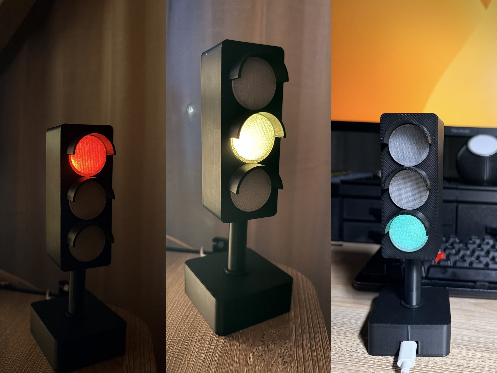

# Do Not Disturb Desk Traffic Light

A small 3D-printed traffic light that sits on my desk and tells the people at home whether they can come talk to me.



| Color | Meaning |
|---|---|
| 🔴 Red | On a call, or audio is playing in my headphones. Don't come in. |
| 🟡 Yellow | In a focus block. Interrupt only if it matters. Blinks in the last 5 minutes. |
| 🟢 Green | Come find me. |
| Off | I'm away from the computer. |

The light only shows what the other person *can't* see. Just sitting at the computer isn't yellow, because they can see that.

## How it works

The board doesn't make any decisions. The computer works out the color and sends one letter over USB serial, about once a second:

| Letter | Effect |
|---|---|
| `R` | red |
| `Y` | yellow |
| `B` | blinking yellow |
| `G` | green |
| `O` | off |
| `?` | board replies `traffic-light` (to find the right serial port) |

If nothing arrives for 15 seconds, the light turns itself off. That way it never gets stuck on an old color when the laptop sleeps or the cable comes out.

Because all the rules live on the computer, you can change them without reflashing.

### The rules I use (checked in order)

1. **Red**: manual red (keyboard shortcut), the microphone is in use (dictation apps don't count), or real sound is coming out of the headphones
2. **Off**: no keyboard or mouse input for 5 minutes
3. **Yellow**: inside a focus block (a Google Calendar Focus Time event, or one started from a shortcut)
4. **Green**: everything else

My own sender script is tied to my personal setup, so it isn't here. The protocol is simple enough that a few lines will drive the light:

```python
# pip install pyserial
import serial, time
port = serial.Serial("/dev/cu.usbmodem1101", 115200)   # your port will differ
while True:
    port.write(b"G")      # replace with your own logic
    time.sleep(1)
```

## Parts

- Seeed Studio XIAO ESP32-C3
- 5 LEDs of WS2812B strip, 60 LEDs/m, **one uncut piece** (LEDs 0 / 2 / 4 light green / yellow / red; 1 and 3 stay off)
- 3 short wires, USB-C cable
- Filament: clear PETG for the lenses, black PLA for the body

Wiring: strip DIN → **D1**, 5V → 5V, GND → GND. Don't use D0: it's a boot strapping pin, and a strip on it can stop the board from booting.

Thread the wires through the pole **before** you solder.

## Firmware

[`firmware/traffic_light_fw/traffic_light_fw.ino`](firmware/traffic_light_fw/traffic_light_fw.ino). Needs the Adafruit NeoPixel library.

```bash
arduino-cli compile --fqbn esp32:esp32:XIAO_ESP32C3 firmware/traffic_light_fw
arduino-cli upload  --fqbn esp32:esp32:XIAO_ESP32C3 -p <port> firmware/traffic_light_fw
```

On power-up it flashes green, yellow, red once, so you can check the LEDs line up.

## 3D model

[`cad/traffic_light.scad`](cad/traffic_light.scad) is the full OpenSCAD source. Export each part:

```bash
cd cad
for p in housing cover lenses pole base plate; do
  openscad -D "part=\"$p\"" -o "$p.stl" traffic_light.scad
done
```

No supports needed. Print the lenses in clear PETG and everything else in black PLA. The pole screws into the base; the other parts push in and hold on crush ribs, so no glue.

## License

MIT
